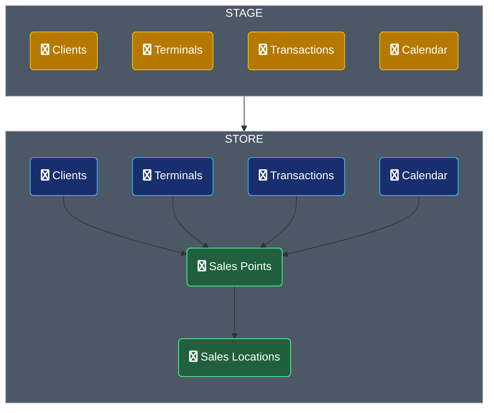

[![Telegram](https://img.shields.io/badge/Telegram-blue.svg?logo=data%3Aimage%2Fsvg%2Bxml%3Bbase64%2CPHN2ZyB3aWR0aD0iMTAwMHB4IiBoZWlnaHQ9IjEwMDBweCIgdmlld0JveD0iMCAwIDEwMDAgMTAwMCIgdmVyc2lvbj0iMS4xIiB4bWxucz0iaHR0cDovL3d3dy53My5vcmcvMjAwMC9zdmciIHhtbG5zOnhsaW5rPSJodHRwOi8vd3d3LnczLm9yZy8xOTk5L3hsaW5rIj4gICAgICAgIDx0aXRsZT5BcnRib2FyZDwvdGl0bGU%2BICAgIDxkZXNjPkNyZWF0ZWQgd2l0aCBTa2V0Y2guPC9kZXNjPiAgICA8ZGVmcz4gICAgICAgIDxsaW5lYXJHcmFkaWVudCB4MT0iNTAlIiB5MT0iMCUiIHgyPSI1MCUiIHkyPSI5OS4yNTgzNDA0JSIgaWQ9ImxpbmVhckdyYWRpZW50LTEiPiAgICAgICAgICAgIDxzdG9wIHN0b3AtY29sb3I9IiMyQUFCRUUiIG9mZnNldD0iMCUiPjwvc3RvcD4gICAgICAgICAgICA8c3RvcCBzdG9wLWNvbG9yPSIjMjI5RUQ5IiBvZmZzZXQ9IjEwMCUiPjwvc3RvcD4gICAgICAgIDwvbGluZWFyR3JhZGllbnQ%2BICAgIDwvZGVmcz4gICAgPGcgaWQ9IkFydGJvYXJkIiBzdHJva2U9Im5vbmUiIHN0cm9rZS13aWR0aD0iMSIgZmlsbD0ibm9uZSIgZmlsbC1ydWxlPSJldmVub2RkIj4gICAgICAgIDxjaXJjbGUgaWQ9Ik92YWwiIGZpbGw9InVybCgjbGluZWFyR3JhZGllbnQtMSkiIGN4PSI1MDAiIGN5PSI1MDAiIHI9IjUwMCI%2BPC9jaXJjbGU%2BICAgICAgICA8cGF0aCBkPSJNMjI2LjMyODQxOSw0OTQuNzIyMDY5IEMzNzIuMDg4NTczLDQzMS4yMTY2ODUgNDY5LjI4NDgzOSwzODkuMzUwMDQ5IDUxNy45MTcyMTYsMzY5LjEyMjE2MSBDNjU2Ljc3MjUzNSwzMTEuMzY3NDMgNjg1LjYyNTQ4MSwzMDEuMzM0ODE1IDcwNC40MzE0MjcsMzAxLjAwMzUzMiBDNzA4LjU2NzYyMSwzMDAuOTMwNjcgNzE3LjgxNTgzOSwzMDEuOTU1NzQzIDcyMy44MDY0NDYsMzA2LjgxNjcwNyBDNzI4Ljg2NDc5NywzMTAuOTIxMjEgNzMwLjI1NjU1MiwzMTYuNDY1ODEgNzMwLjkyMjU1MSwzMjAuMzU3MzI5IEM3MzEuNTg4NTUxLDMyNC4yNDg4NDggNzMyLjQxNzg3OSwzMzMuMTEzODI4IDczMS43NTg2MjYsMzQwLjA0MDY2NiBDNzI0LjIzNDAwNyw0MTkuMTAyNDg2IDY5MS42NzUxMDQsNjEwLjk2NDY3NCA2NzUuMTEwOTgyLDY5OS41MTUyNjcgQzY2OC4xMDIwOCw3MzYuOTg0MzQyIDY1NC4zMDEzMzYsNzQ5LjU0NzUzMiA2NDAuOTQwNjE4LDc1MC43NzcwMDYgQzYxMS45MDQ2ODQsNzUzLjQ0ODkzOCA1ODkuODU2MTE1LDczMS41ODgwMzUgNTYxLjczMzM5Myw3MTMuMTUzMjM3IEM1MTcuNzI2ODg2LDY4NC4zMDY0MTYgNDkyLjg2NjAwOSw2NjYuMzQ5MTgxIDQ1MC4xNTAwNzQsNjM4LjIwMDAxMyBDNDAwLjc4NDQyLDYwNS42Njg3OCA0MzIuNzg2MTE5LDU4Ny43ODkwNDggNDYwLjkxOTQ2Miw1NTguNTY4NTYzIEM0NjguMjgyMDkxLDU1MC45MjE0MjMgNTk2LjIxNTA4LDQzNC41NTY0NzkgNTk4LjY5MTIyNyw0MjQuMDAwMzU1IEM1OTkuMDAwOTEsNDIyLjY4MDEzNSA1OTkuMjg4MzEyLDQxNy43NTg5ODEgNTk2LjM2NDc0LDQxNS4xNjA0MzEgQzU5My40NDExNjgsNDEyLjU2MTg4MSA1ODkuMTI2MjI5LDQxMy40NTA0ODQgNTg2LjAxMjQ0OCw0MTQuMTU3MTk4IEM1ODEuNTk4NzU4LDQxNS4xNTg5NDMgNTExLjI5Nzc5Myw0NjEuNjI1Mjc0IDM3NS4xMDk1NTMsNTUzLjU1NjE4OSBDMzU1LjE1NDg1OCw1NjcuMjU4NjIzIDMzNy4wODA1MTUsNTczLjkzNDkwOCAzMjAuODg2NTI0LDU3My41ODUwNDYgQzMwMy4wMzM5NDgsNTczLjE5OTM1MSAyNjguNjkyNzU0LDU2My40OTA5MjggMjQzLjE2MzYwNiw1NTUuMTkyNDA4IEMyMTEuODUxMDY3LDU0NS4wMTM5MzYgMTg2Ljk2NDQ4NCw1MzkuNjMyNTA0IDE4OS4xMzE1NDcsNTIyLjM0NjMwOSBDMTkwLjI2MDI4Nyw1MTMuMzQyNTg5IDIwMi42NTkyNDQsNTA0LjEzNDUwOSAyMjYuMzI4NDE5LDQ5NC43MjIwNjkgWiIgaWQ9IlBhdGgtMyIgZmlsbD0iI0ZGRkZGRiI%2BPC9wYXRoPiAgICA8L2c%2BPC9zdmc%2B)](https://t.me/+XFptyUgPK481NWNi)

# РАЗРАБОТКА BIG DATA ПРОДУКТОВ

Данный проект предназначен для практического занятия по курсу BIG DATA от Сбер Аналитики. В рамках занятия вы научитесь:
* Преобразовывать разрозненные неструктурированные данные в ценные сведения для бизнеса
* Визуализировать полученные сведения
* Проверять гипотезы и делать выводы основываясь на данных
* Работать с фреймворком `Apache Spark`

## Инструкция по настройке окружения

Для работы с данным проектом Вам понадобиться установить на рабочий компьютер или ноутбук следующее программное обеспечение:
* `Java Development Kit (JDK)` по [инструкции](/readme/GUIDE_Java_JDK.md)
* Среда разработки `IntelliJ IDEA Community (Windows)` по [инструкции](/readme/GUIDE_IntelliJ_IDEA.md)
* Фреймворк `Apache Spark` по [инструкции](/readme/GUIDE_Apache_Spark.md)

## Flowchart потоков данных 

