# Установка Apache Spark в Windows

`Apache Spark` - это фреймворк с открытым исходным кодом для реализации распределённой обработки данных, входящий в экосистему проектов Hadoop.

Чтобы установить `Apache Spark` в `Windows`, нужно:
* Загрузить дистрибутив `Apache Spark`
* Сверить корректность файлов дистрибутива
* Установить `Apache Spark`
* Установить утилиту `winutils.exe` для работы в `Windows`
* Создать переменные окружения
* Запустить `Apache Spark`

## 1. Скачиваем дистрибутив `Apache Spark`

На [сайте разработчика](https://spark.apache.org/downloads.html) выбираем версию `Spark release: 3.0.3` и пакет `package type: Pre-build for Apache Hadoop 2.7`

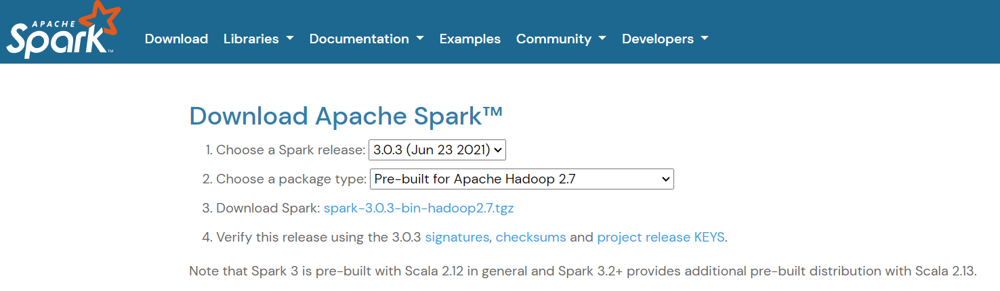

Нажимаем на ссылку `spark-3.0.3-bin-hadoop2.7.tgz` для скачивания `tgz` архива с дистрибутивом `Apache Spark`

На странице загрузки выбираем любой подходящий сайт с дистрибутивом

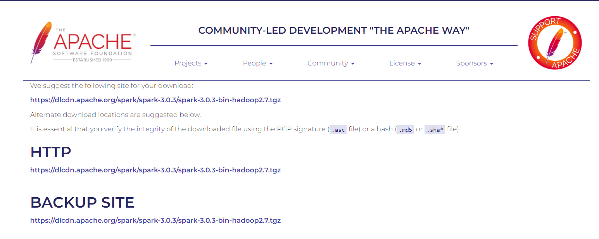

## 2. Сверяем корректность файлов

Переходим в папку с загруженным архивом. Открываем приложение `Командная строка` введя в поиск `Windows` слово `cmd`

В командной строке прописываем команду `certutil -hashfile d:\Downloads\spark-3.0.3-bin-hadoop2.7.tgz SHA512`. Если местоположение архива у вас отличается от `d:\Downloads\spark-3.0.3-bin-hadoop2.7.tgz`, то замените на ваш путь

При правильном выполнении команды на экране выведется сообщение `CertUtil: -hashfile — команда успешно выполнена`

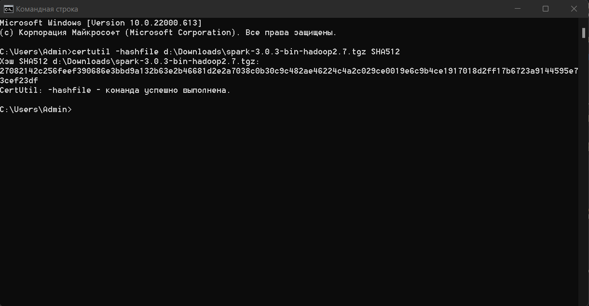

## 3. Устанавливаем `Apache Spark`

Создаем корневую папку `Spark` внутри жесткого диска `d:\Spark`

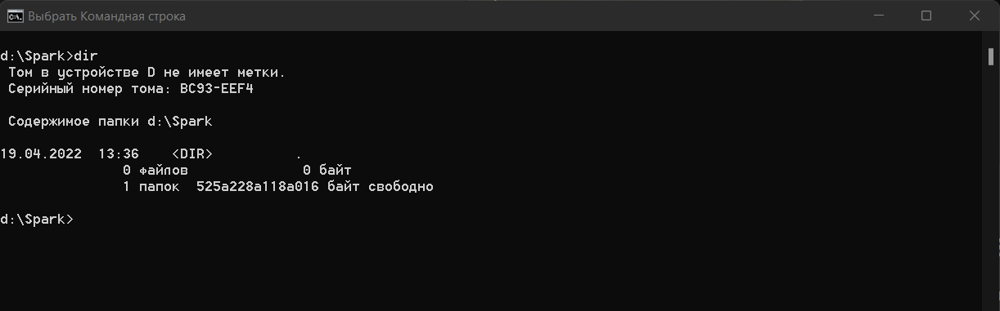

Правой кнопкой мыши нажимаем на загруженный архив `d:\Downloads\spark-3.0.3-bin-hadoop2.7.tgz` и разархивируем его в корневую папку `d:\Spark`

Теперь внутри корневой папки должна находиться папка с дистрибутивом `Apache Spark` т.е. `d:\Spark\spark-3.0.3-bin-hadoop2.7`

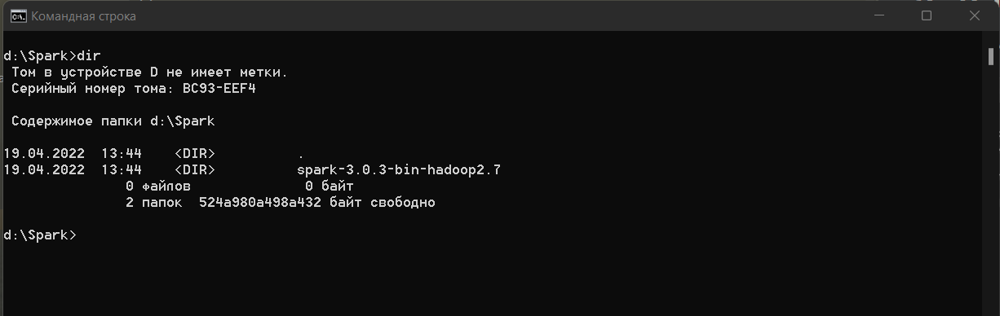

## 4. Установить утилиту `winutils.exe`

На [сайте разработчика](https://github.com/cdarlint/winutils) выбираем версию `hadoop-2.7.7` и перейдите внутрь папки `hadoop-2.7.7/bin`

Левой кнопкой мыши нажимаем на файл `winutils.exe` и справа на кнопку `Download`

Создаем корневую папку `hadoop` и под-папку `bin` внутри жесткого диска `d:\hadoop\bin`

Копируем загруженный файл `winutils.exe` в созданную папку `d:\hadoop\bin\winutils.exe`

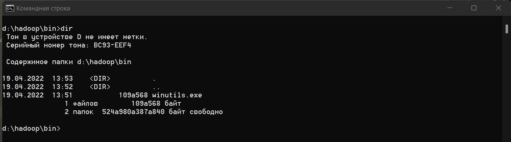

## 5. Создаем переменные окружения

Открываем переменные среды введя в поиск `Windows` слово `systempropertiesadvanced` и нажав на кнопку `Переменные среды...`

В разделе `Переменные среды пользователя...` создаем две новые системные переменные
* переменная `HADOOP_HOME` со значением `d:\hadoop`
* переменная `SPARK_HOME` со значением `d:\Spark\spark-3.0.3-bin-hadoop2.7`

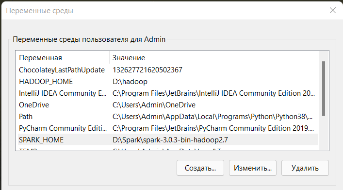

Теперь редактируем уже имеющуюся переменную `Path` добавив в нее пути расположения
* добавляем путь `%HADOOP_HOME%\bin`
* добавляем путь `%SPARK_HOME%\bin`

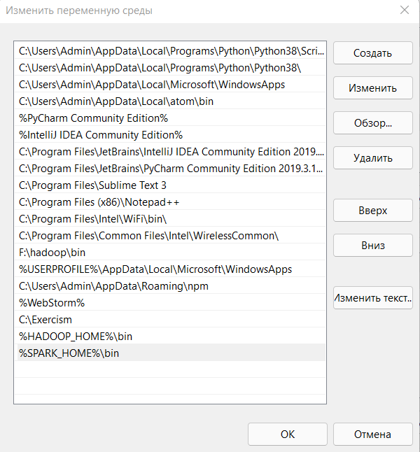

Чтобы изменения по созданию переменных среды вступили в силу **перезагружаем компьютер**

Проверяем корректность создания переменных вводя в `Командной строке`
* `echo %HADOOP_HOME%` - должно появиться сообщение `d:\hadoop`
* `echo %SPARK_HOME%` - должно появиться сообщение `d:\Spark\spark-3.0.3-bin-hadoop2.7`
* `echo %Path%` - должно появиться сообщение с длинным списком путей, среди которых должны быть `d:\hadoop\bin` и `d:\Spark\spark-3.0.3-bin-hadoop2.7\bin`

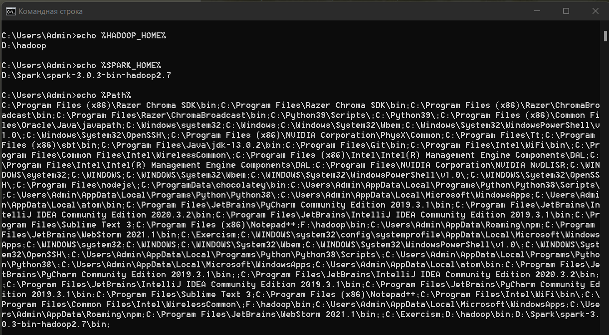

## 6. Запускаем `Apache Spark`

Открываем приложение `Командная строка` введя в поиск `Windows` слово `cmd`

Вводим команду запуска `Apache Spark` интерактивной оболочки для работы с данными `spark-shell` или полной командой `d:\Spark\spark-3.0.3-bin-hadoop2.7\bin\spark-shell`

Если все предыдущие шаги были сделаны правильно, то выведется сообщение об успешном запуске `Apache Spark`

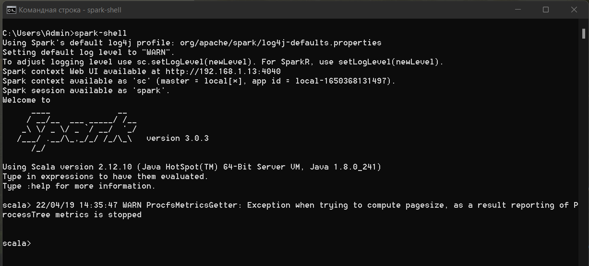

Чтобы узнать запущенную версию `Apache Spark` вводим команду:

`spark.version`

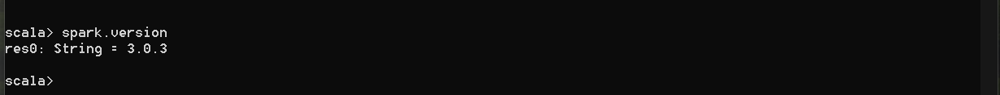

Чтобы создать примитивные данные вводим команду:

`val data = Seq((1, "a"), (2, "b"), (3, "c")).toDF("num", "char")`

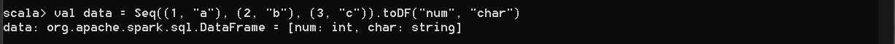

Чтобы узнать количество строк у данных вводим команду:

`data.count`

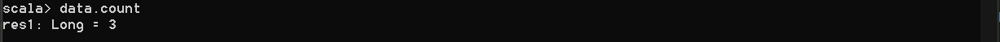

Чтобы вывести на экран пример содержимого в 20 строк данных вводим команду:

`data.show(20, false)`

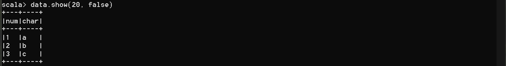

Чтобы прочитать данные из текстового файла вводим команду:

`val file = spark.read.textFile("d:/Spark/spark-3.0.3-bin-hadoop2.7/examples/src/main/resources/people.txt")`

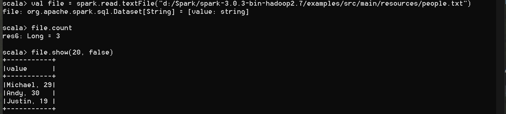

Чтобы закрыть интерактивную оболочку `Apache Spark` вводим команду:

`:q`

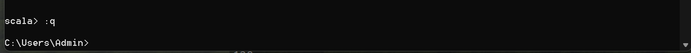
