# Установка проекта

Для работы с проектом на локальном компьютере или ноутбуке необходимо проделать следующие шаги:
* Клонировать проект в свой личный `github` аккаунт
* Клонировать проект из `github` аккаунта на личный компьютер или ноутбук
* Собрать проект в `Intellij IDEA`
* Добавить в проект данные для расчетов
* Запустить проект для расчета данных и их анализа

## Клонирование проекта на GitHub

Заходим на сайт [github](https://github.com) в личный аккаунт. Для примера будет использоваться аккаунт https://github.com/SberAnalitica

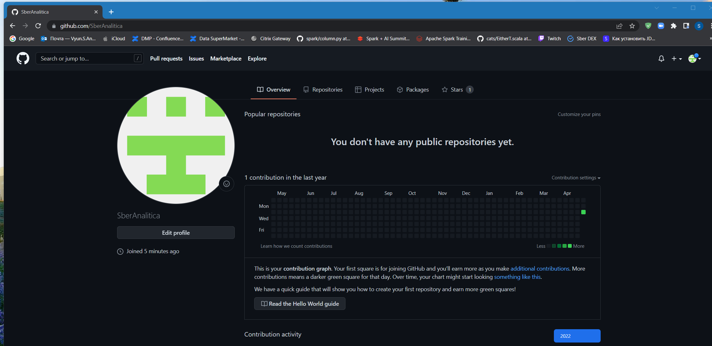

Слева сверху в окне поиска вводим `sber-bigdata-course` и выбираем `Search All GitHub`

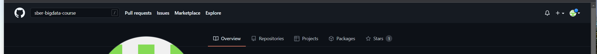

В результате должна найтись ссылка на данный проект https://github.com/VyunSergey/sber-bigdata-course

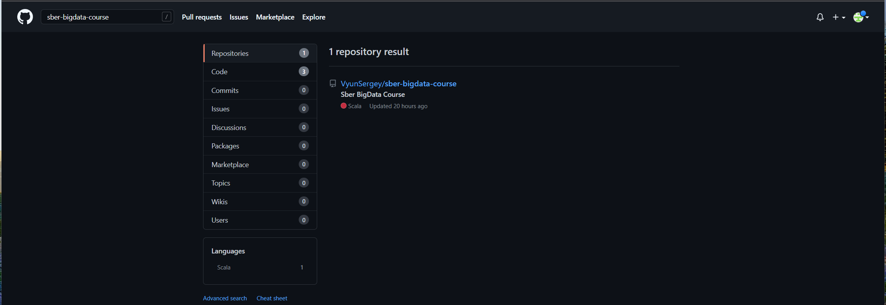

Если не удается найти ссылку, можно сразу перейти по [ссылке](https://github.com/VyunSergey/sber-bigdata-course), убедившись, что вы залогинились в ваш `github` аккаунт.
На домашней странице проекта справа сверху нажимаем кнопку `Fork` для копирования проекта в свой аккаунт.

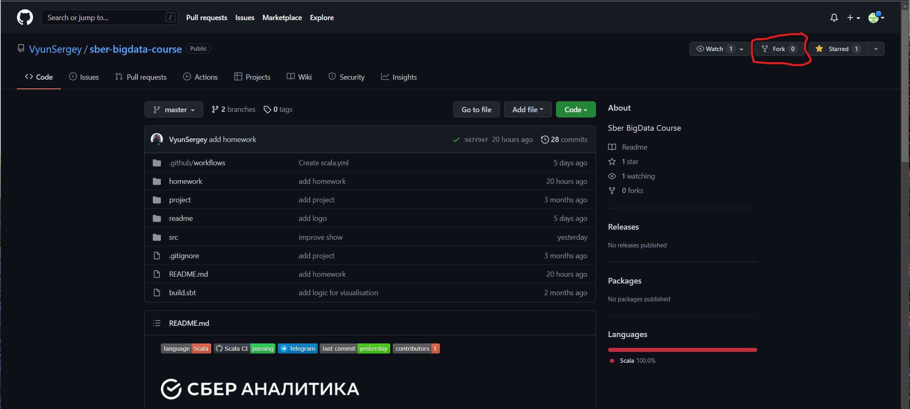

Откроется окно, в котором в разделе `Owner` нужно выбрать ваш `github` аккаунт для копирования проекта и скопировать его, нажав кнопку `Create fork`

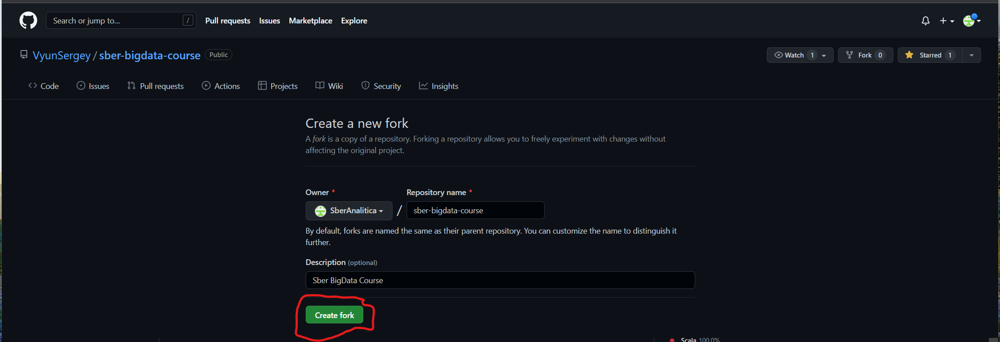

В результате уже в вашем `github` аккаунте должен появиться проект `sber-bigdata-course`

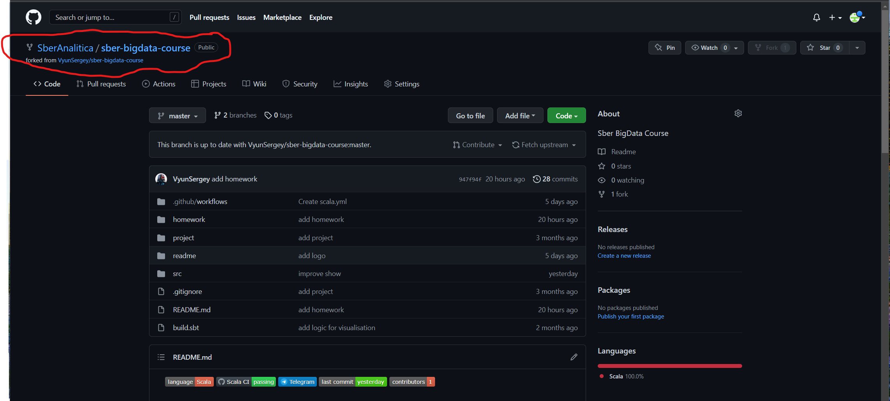

## Клонирование проекта локально

Справа сверху нажимаем на кнопку `Code` и выбираем `Clone` по `HTTPS`, копируем в буфер обмена команду для клонирования проекта.

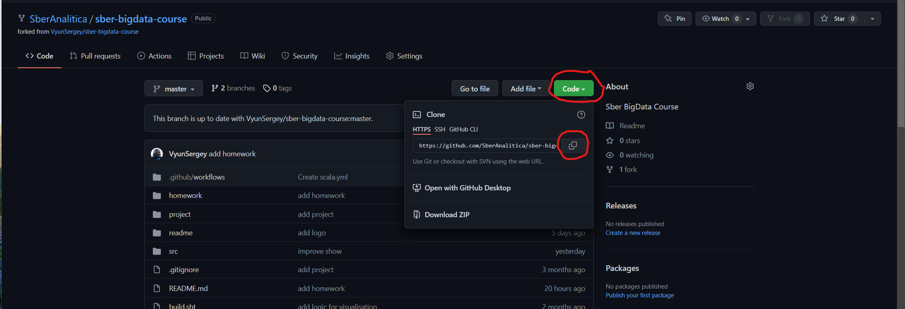

Открываем на компьютере консоль, для примера будет использоваться консоль `Git Bash`, которая стандартно устанавливается совместно с `Git`. 
Определяемся с корневой папкой на компьютере или ноутбуке, где будет храниться проект. 
Для примера будет использоваться папка `C:/Users/Admin/IdeaProjects/sber-test`. 
Командой `cd <полный путь до папки>` переходим в нужную папку, где будет храниться проект.

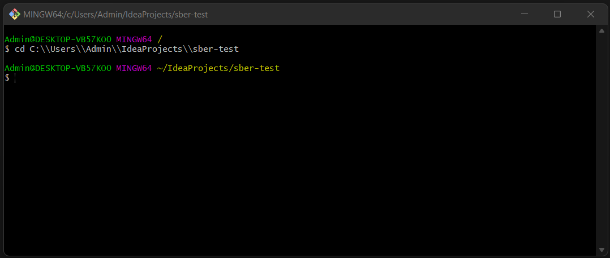

В консоли вводим команду `git clone <вставляем скопированую команду из буфера обмена>`

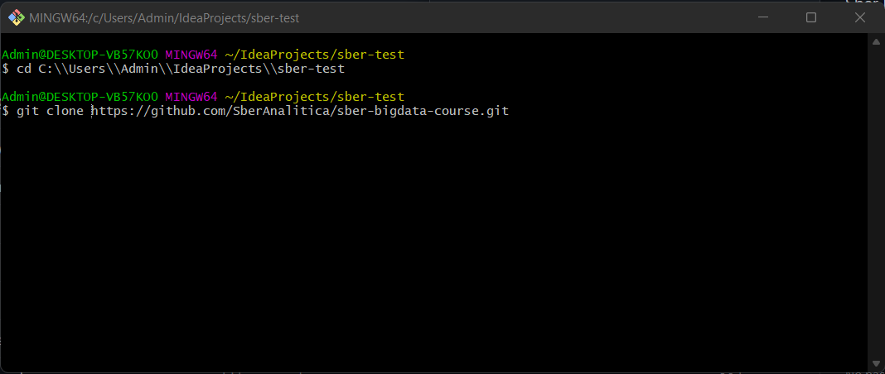

Если все введено правильно, то `Git` скопирует проект с вашего `github` аккаунта на локальный компьютер или ноутбук

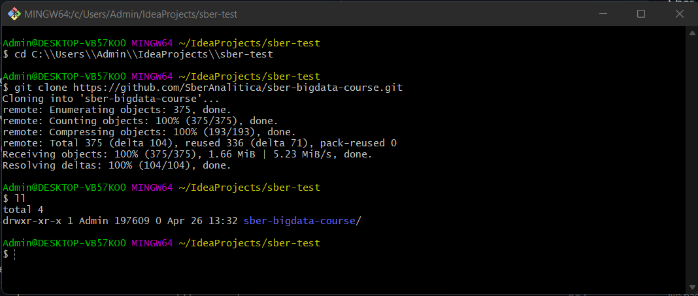

В выбранной корневой папке появится папка с проектом `sber-bigdata-course`

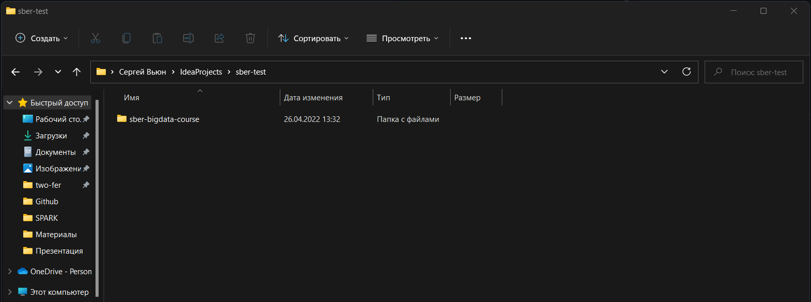

## Сборка проекта

Открываем установленный на компьютер `Intellij IDEA` и выбираем `Projects -> Open` или `File -> Open`, если у вас уже открыт другой проект

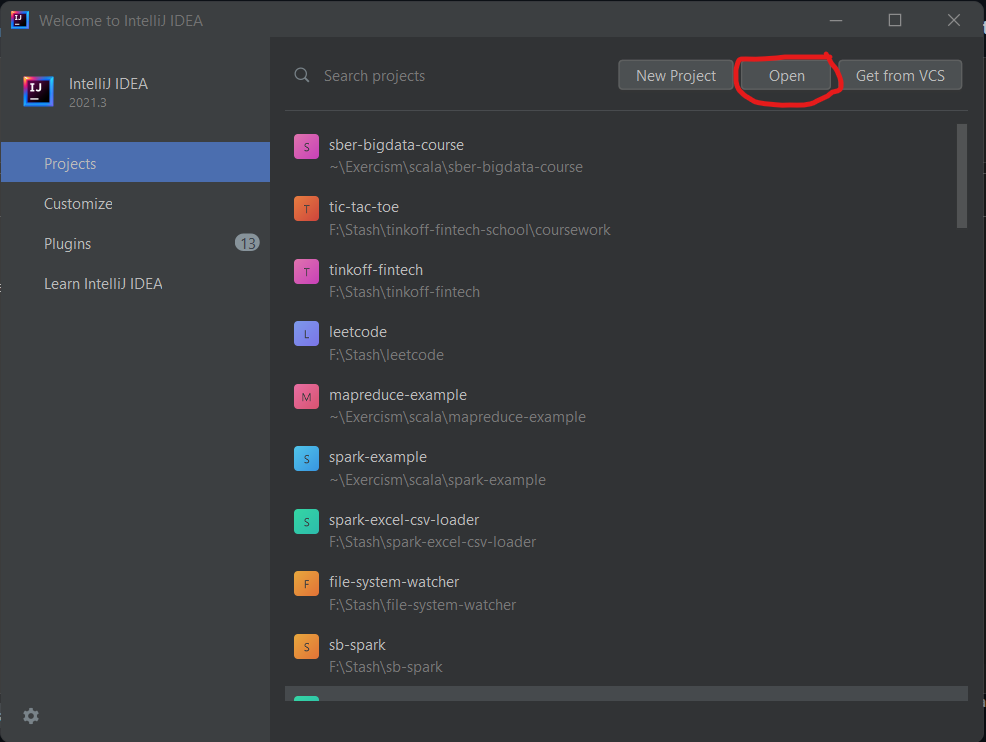

Указываем путь до папки `sber-bigdata-course`, которую вы скопировали в вашу корневую папку и нажимаем кнопку `OK`

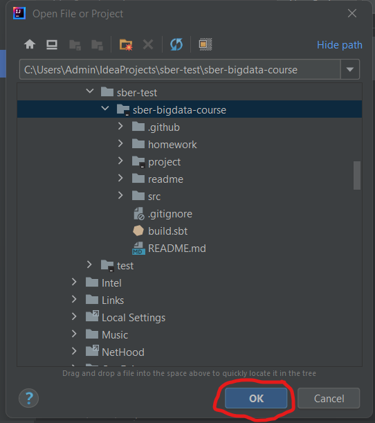

Во всплывающем окне(если оно появилось) подтверждения достоверности проекта нажимаем на кнопку `Trust Project`

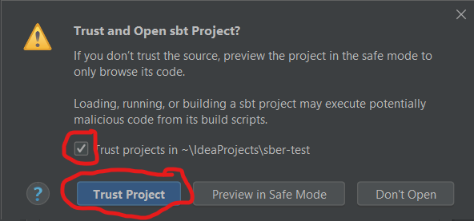

После этого `Intellij IDEA` начнет открывать проект и собирать его, скачивая из интернета все необходимые зависимости. 
На этом этапе необходимо стабильное подключение к интернету с нормальной скоростью передачи пакетов. Сборка может занять 5 - 15 минут.

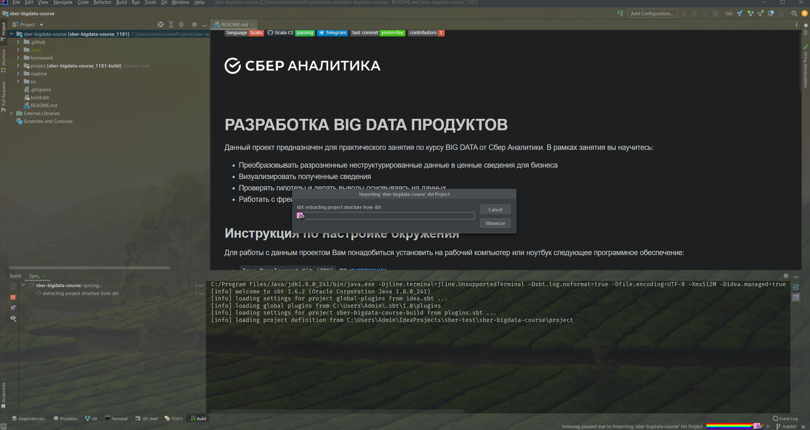

Если сборка проекта завершилась успешно, то слева в окне появится зеленая галка, а в консоли выведется сообщение `[success] Total time ...`. Тогда шаги ниже делать не надо, можно переходить к следующему разделу.

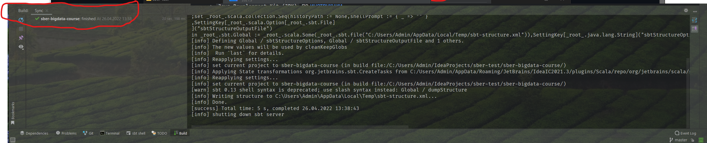

Если сборка проекта зависла или завершилась с ошибкой, тогда открываем окно с настройками `File -> Settings...` и выбираем раздел `Build, Execution, Deployment`

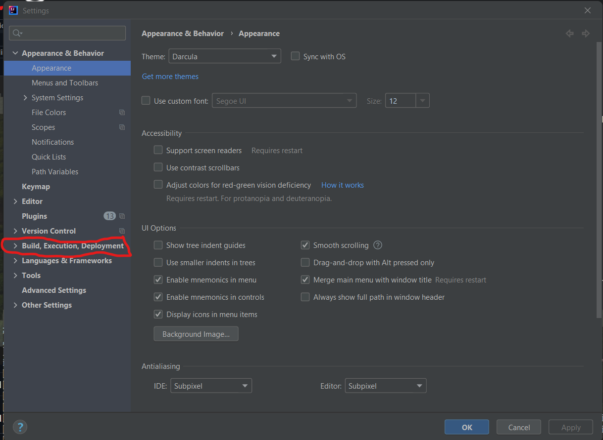

Переходим в подраздел `Build Tools -> sbt` и устанавливаем галки и значения параметров как на скриншоте ниже, нажимаем кнопки `Apply` и `OK`

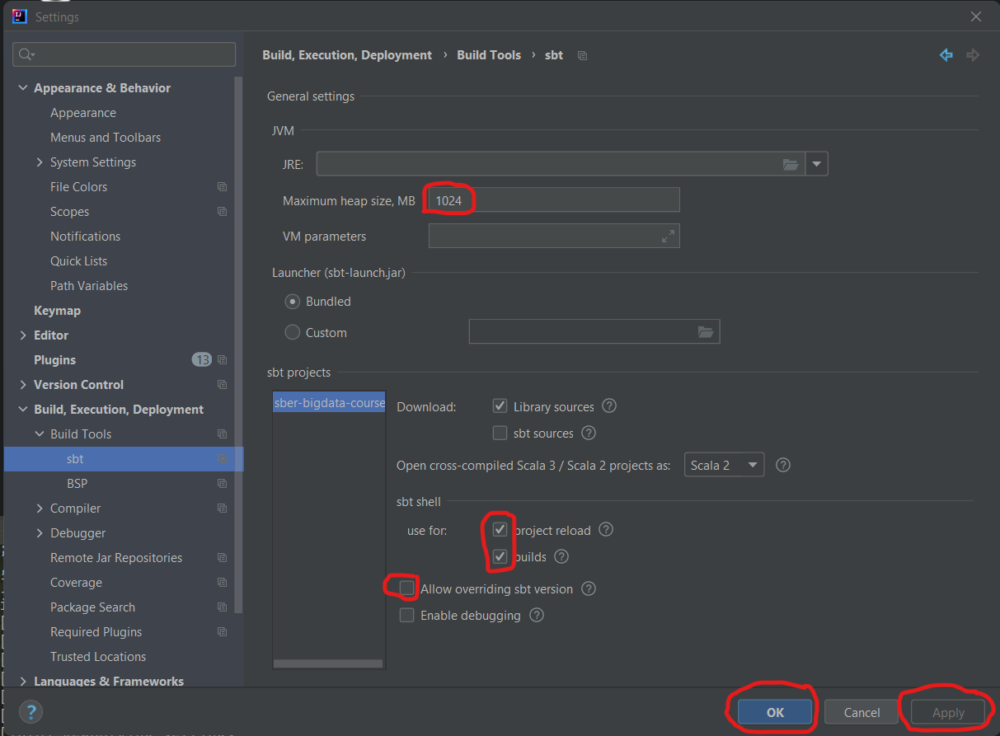

Закрываем окно с настройками, справа сверху проекта нажимаем на кнопку `sbt`, в открывшемся окне нажимаем на иконку обновления проекта в виде круга

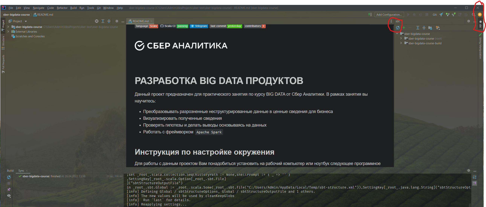

Должно открыться окно `sbt shell` и заново начаться сборка проекта с более подробным описанием происходящих шагов.
На этом этапе необходимо стабильное подключение к интернету с нормальной скоростью передачи пакетов. Сборка может занять 5 - 15 минут.

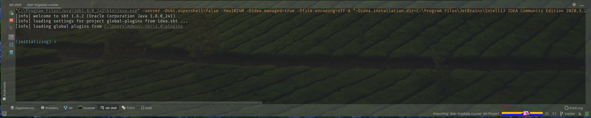

Если сборка проекта завершилась успешно, то в консоли выведется сообщение `[success] Total time ...`.


## Добавление данных

Справа сверху нажимаем на кнопку `Project -> sber-bigdata-course`, открывается структура папок проекта. Папка с исходными файлами проекта, которую нужно редактировать, называется `src`

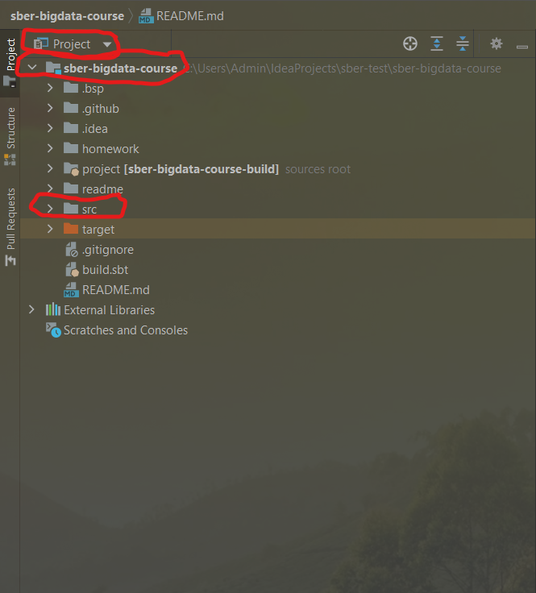

В папке `src` открываем подпапку `main -> resources`, она должна содержать в себе файлы `application.conf` и `log4j.properties`

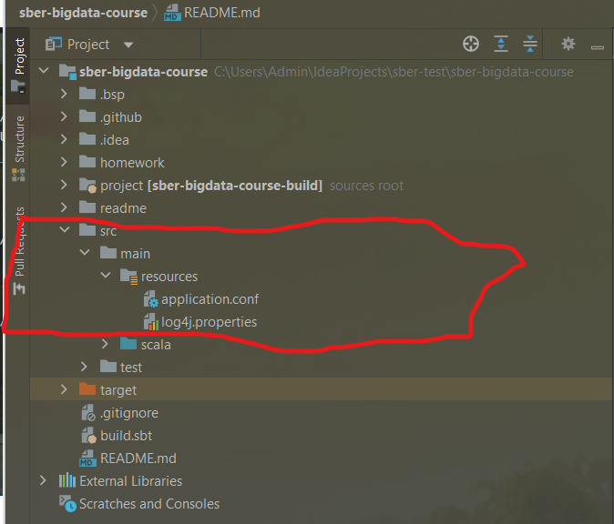

В этой папке необходимо создать подпаки для исходных данных проекта. 
Сделать это можно отдельно через проводник `Windows` или в `Intellij IDEA` нажимаем правой кнопкой мыши на папке `resources` выбираем `New -> Directory` даем название новой папке. 

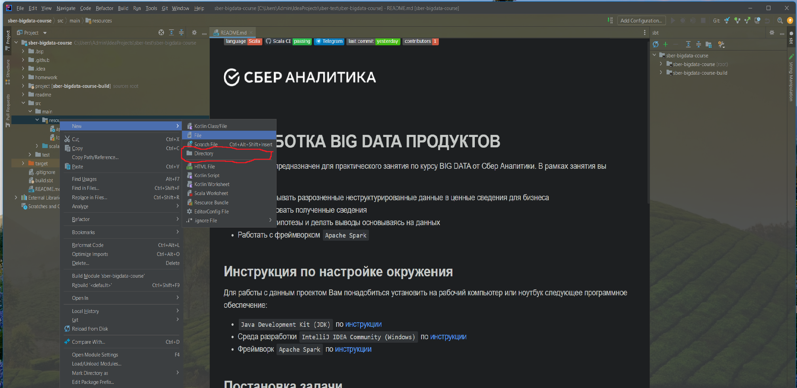

Нужно создать следующую структуру вложенных папок внутри папки `resources`

```sourcegraph
resources
|--data
|  |--datamart
|  |  |--src
|  |  |--tgt
|  |--stage
|     |--src
|     |--tgt
|--application.conf
|--log4j.properties
```

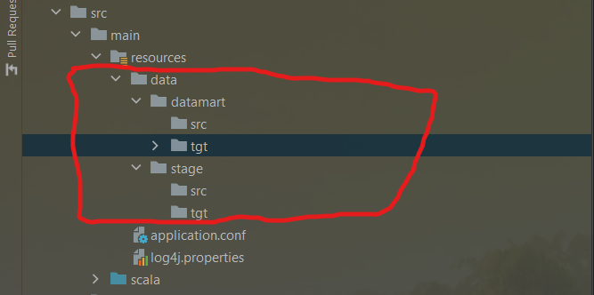

Внутрь папки `/resources/data/stage/src` необходимо распаковать скаченные данные для проекта и переименовать папки с данными как показано на скриншоте ниже

```sourcegraph
stage
|--src
|  |--calendar
|  |--clients
|  |--dict_age_group
|  |--dict_gender
|  |--dict_trans_category
|  |--terminals
|  |--transactions
|--tgt
```

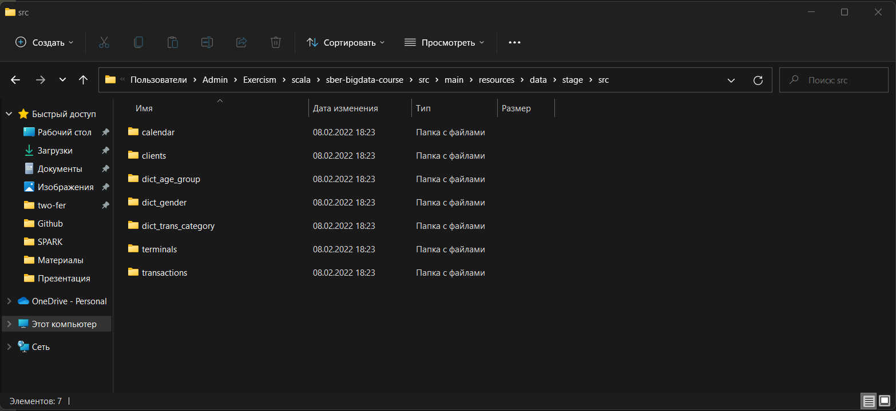

В результате в `Project Structure` должна появиться следующая структура папок с данными в них

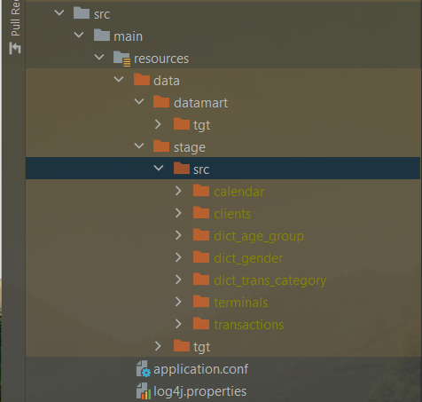

Следующим шагом необходимо в файле `application.conf` поменять корневой путь до папок с данными на ваш корневой путь. 
Для примера используется путь `C:/Users/Admin/IdeaProjects/sber-test/sber-bigdata-course/src/main/resources/data/stage`.

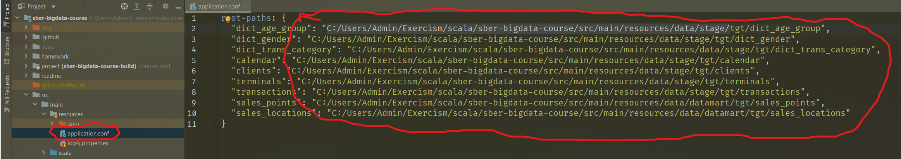

Теперь можно переходить к запуску проекта
