# Запуск проекта

Запуск проекта осуществляется через главный файл `Main.scala`, который расположен в папке `/src/main/scala/ru/sberbank/bigdata/study/course/sales/Main.scala`
Для запуска нужно нажать на иконку зеленого треугольника рядом с названием `Main`.

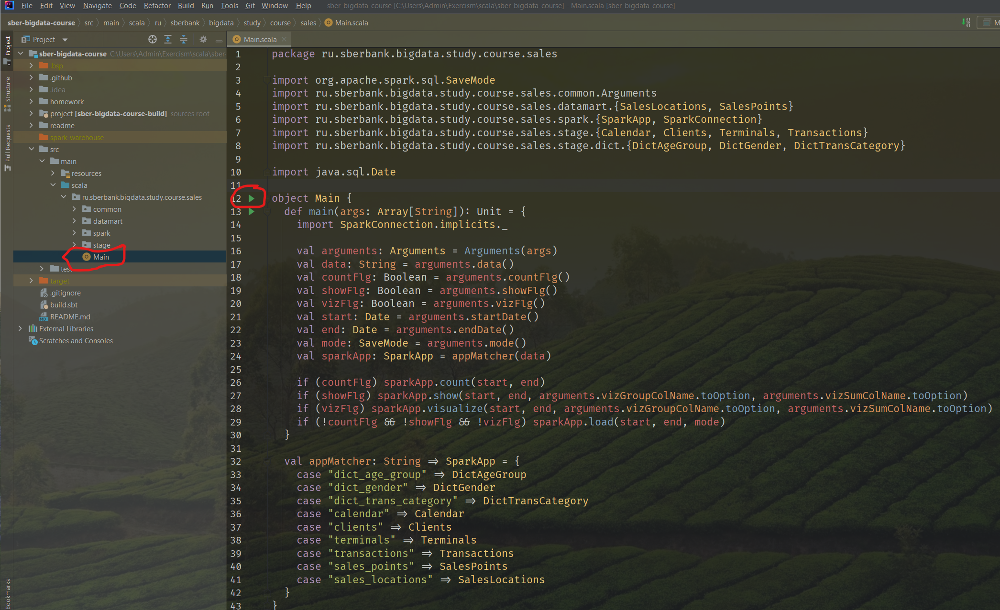

Расчет данных проекта нужно проводить строго в следующей последовательности:
1) Расчет справочника `DictAgeGroup`
2) Расчет справочника `DictGender`
3) Расчет справочника `DictTransCategory`
4) Расчет календаря `Calendar`
5) Расчет клиентов `Clients`
6) Расчет терминалов `Terminals`
7) Расчет транзакций `Transactions`
8) Расчет торговых точек `SalesPoints`
9) Расчет торговых локаций `SalesLocations`
10) Анализ рассчитанных данных

Для расчета данных необходимо менять аргументы передаваемые программе через окно `Modify Run Configuration...`

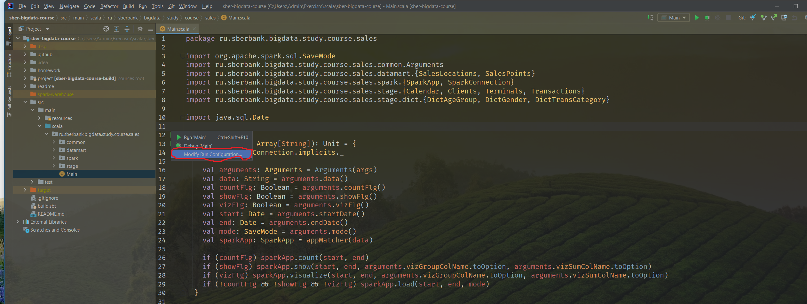

Для получения полного перечня всех аргументов программы, их возможных значений и примера запуска нужно запустить программу с аргументом `--help`.
Выставляем аргумент, нажимаем кнопки `Apply` и `OK`.

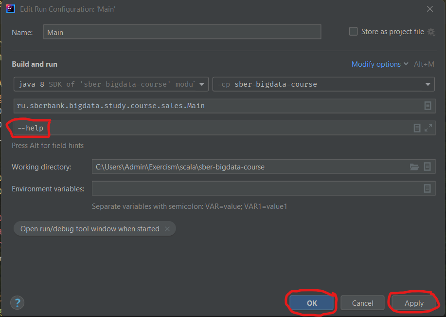

Запускаем программу нажав зеленый треугольник. В результате в консоли должно появиться вспомогательное сообщение с описанием аргументов программы.

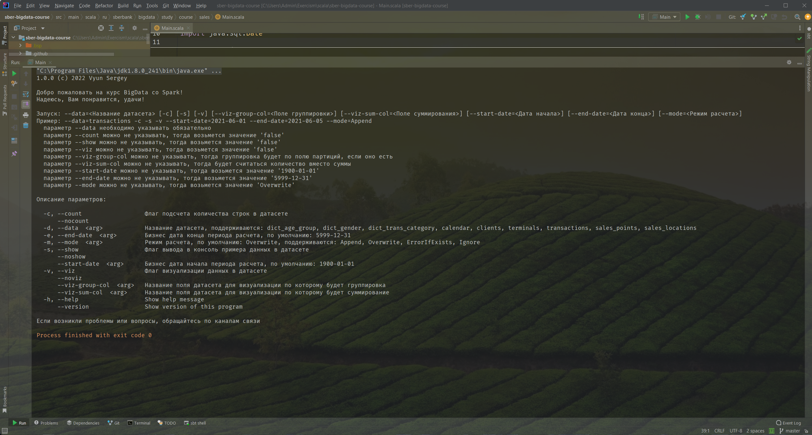

Ознакомившись с описанием аргументов вы готовы запускать расчет данных.

## 1. Расчет справочника `DictAgeGroup`

Нужно запустить программу с аргументом `--data=dict_age_group`.
Выставляем аргумент, нажимаем кнопки `Apply` и `OK`.
Запускаем программу нажав зеленый треугольник.

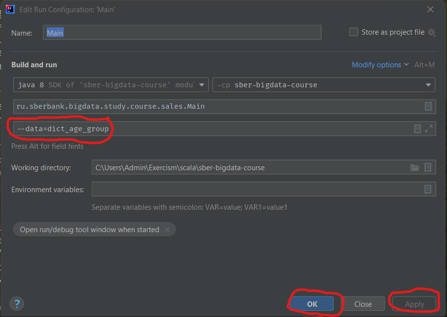

## 2. Расчет справочника `DictGender`

Нужно запустить программу с аргументом `--data=dict_gender`.
Выставляем аргумент, нажимаем кнопки `Apply` и `OK`.
Запускаем программу нажав зеленый треугольник.

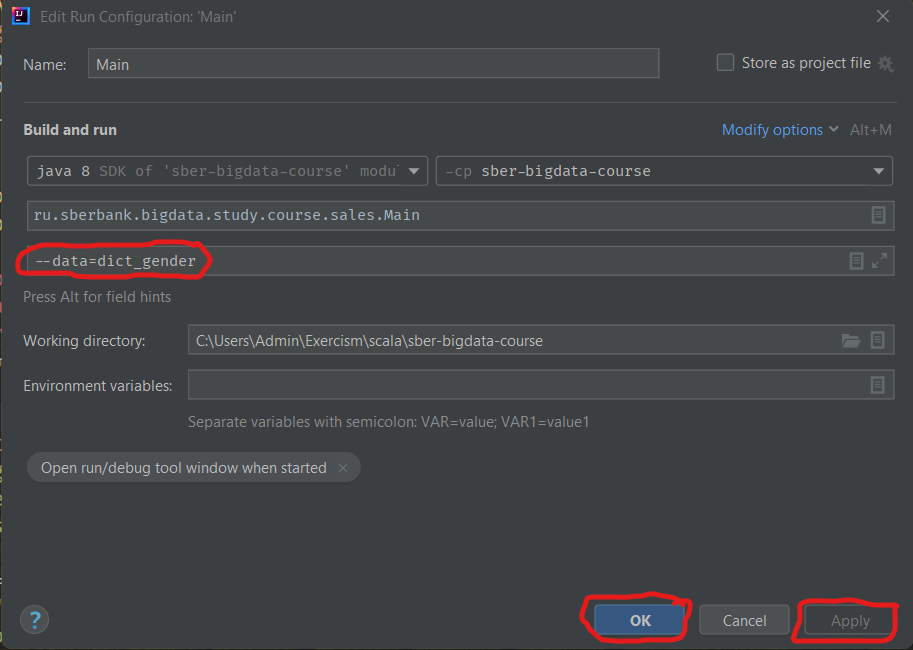

## 3. Расчет справочника `DictTransCategory`

Нужно запустить программу с аргументом `--data=dict_trans_category`.
Выставляем аргумент, нажимаем кнопки `Apply` и `OK`.
Запускаем программу нажав зеленый треугольник.

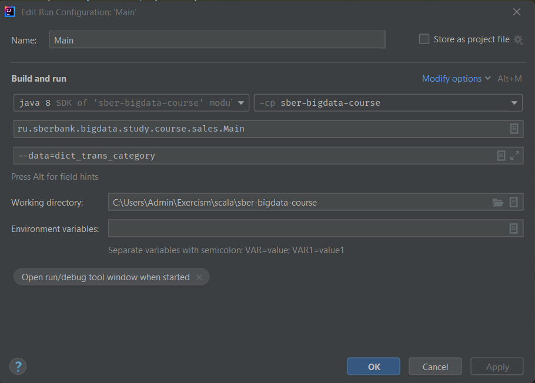

## 4. Расчет календаря `Calendar`

Нужно запустить программу с аргументом `--data=calendar`.
Выставляем аргумент, нажимаем кнопки `Apply` и `OK`.
Запускаем программу нажав зеленый треугольник.

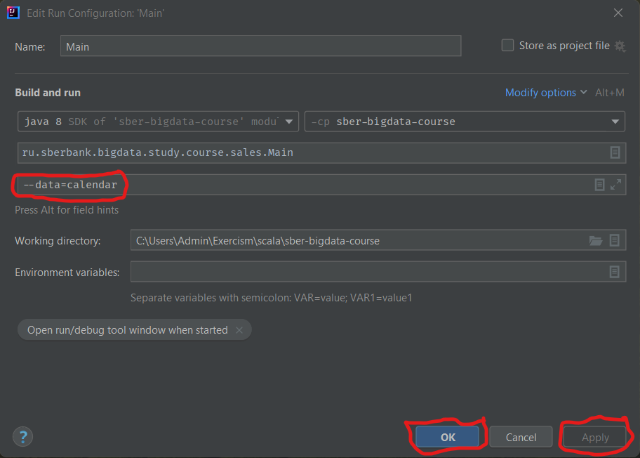

## 5. Расчет клиентов `Clients`

Нужно запустить программу с аргументом `--data=clients`.
Выставляем аргумент, нажимаем кнопки `Apply` и `OK`.
Запускаем программу нажав зеленый треугольник.

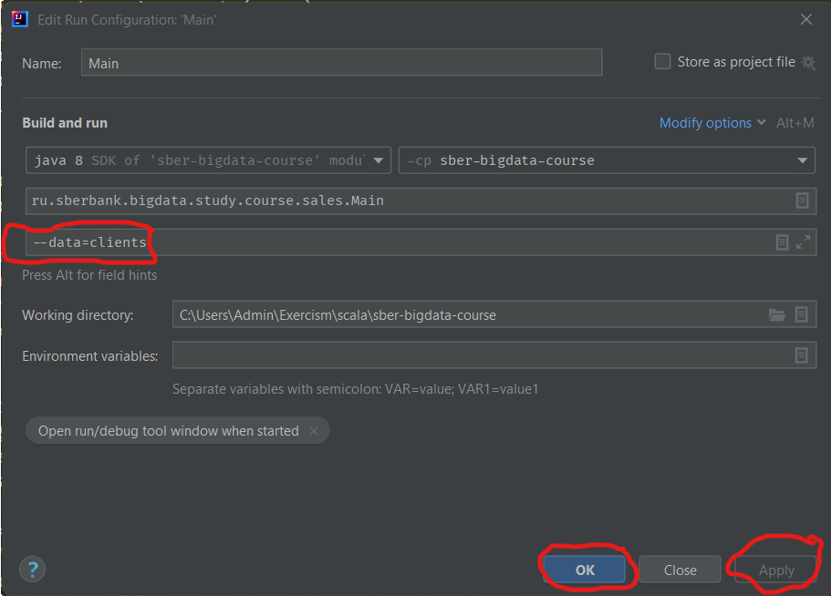

## 6. Расчет терминалов `Terminals`

Нужно запустить программу с аргументом `--data=terminals`.
Выставляем аргумент, нажимаем кнопки `Apply` и `OK`.
Запускаем программу нажав зеленый треугольник.

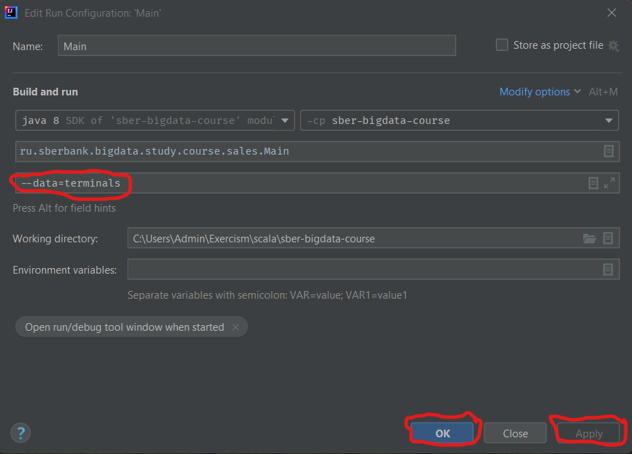

## 7. Расчет транзакций `Transactions`

Нужно запустить программу с аргументом `--data=transactions`.
Выставляем аргумент, нажимаем кнопки `Apply` и `OK`.
Запускаем программу нажав зеленый треугольник.

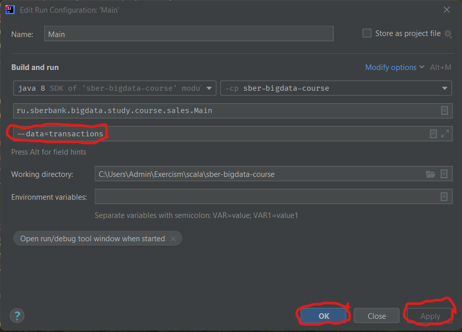

Общий объем оперативной памяти `RAM` необходимый `Apache Spark` для обработки всех данных по транзакциям составляет около `8Gb`.
Если на вашем компьютере или ноутбуке нет столько свободной оперативной памяти, то скорее всего расчет всех данных упадет с ошибкой.
В таком случае необходимо считать данные порциями разделя их по периодам транзакций, важно чтобы периоды не пересекались, иначе данные задублируются.

Это можно сделать через аргументы программы:
* `--start-date` - дата начала периода расчета
* `--end-date` - дата конца периода расчета

Тогда нужно рассчитывать данные в разных режимах:
* `--mode=Overwrite` - режим расчета для первого периода расчета
* `--mode=Append` - режим расчета для всех последующих периодов расчета

Если мы решим рассчитывать данные по периодам в `6 месяцев`, то получим последовательность запусков со следующими аргументами:
1) `--data=transactions --start-date=2020-07-01 --end-date=2020-12-31 --mode=Overwrite`
2) `--data=transactions --start-date=2021-01-01 --end-date=2021-06-30 --mode=Append`

Если мы решим рассчитывать данные по периодам в `3 месяца`, то получим последовательность запусков со следующими аргументами:
1) `--data=transactions --start-date=2020-07-01 --end-date=2020-09-30 --mode=Overwrite`
2) `--data=transactions --start-date=2020-10-01 --end-date=2021-12-31 --mode=Append`
3) `--data=transactions --start-date=2021-01-01 --end-date=2021-03-31 --mode=Append`
4) `--data=transactions --start-date=2021-04-01 --end-date=2021-06-30 --mode=Append`

## 8. Расчет торговых точек `SalesPoints`

Нужно запустить программу с аргументом `--data=sales_points`.
Выставляем аргумент, нажимаем кнопки `Apply` и `OK`.
Запускаем программу нажав зеленый треугольник.

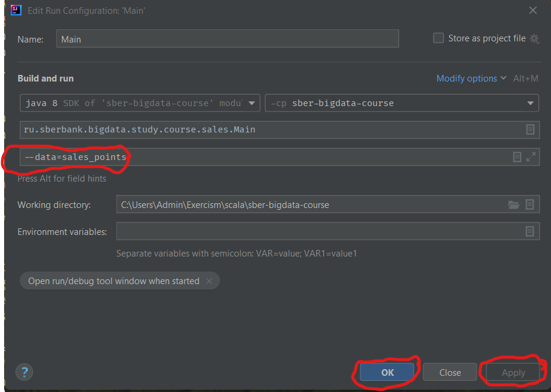

Если в процессе расчета `Apache Spark` не хватило объема свободной оперативной памяти, то расчет можно также делать порциями, аналогично описанному в разделе для расчета транзакций `Transactions`.

## 9. Расчет торговых локаций `SalesLocations`

Нужно запустить программу с аргументом `--data=sales_locations`.
Выставляем аргумент, нажимаем кнопки `Apply` и `OK`.
Запускаем программу нажав зеленый треугольник.

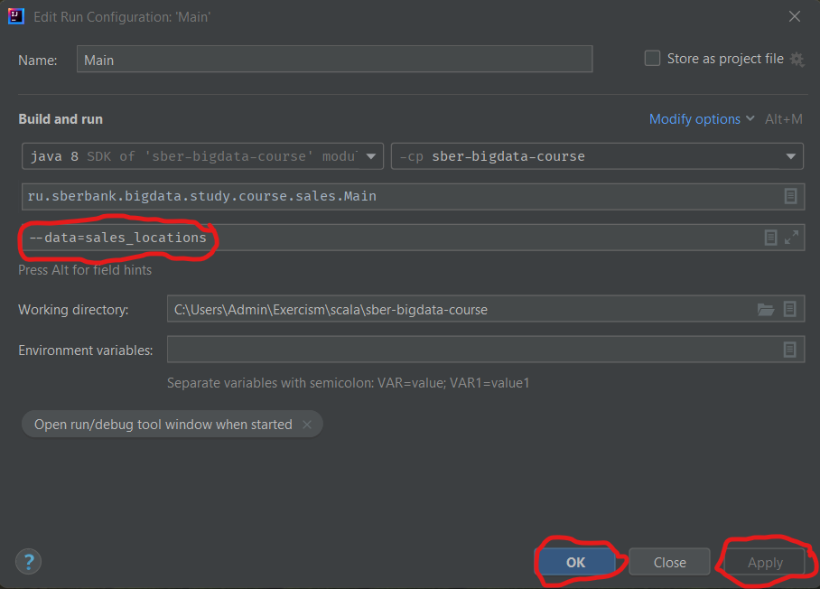

Если в процессе расчета `Apache Spark` не хватило объема свободной оперативной памяти, то расчет можно также делать порциями, аналогично описанному в разделе для расчета транзакций `Transactions`.

## 10. Анализ рассчитанных данных

Проект поддерживает несколько аргументов программы для анализа рассчитанных данных:
* `-c` или `--count` - выведет в консоль количество строк в данных
* `-s` или `--show` - выведет в консоль пример данных из 30 строк или `--num` строк, если передать и этот аргумент 
* `-v` или `--viz` - создаст отдельное окно с графиком на данных

Для анализа только нужной части данных их можно фильтровать с помощью аргументов:
* `--start-date` - дата начала периода анализа
* `--end-date` - дата конца периода анализа

Данные можно группировать и для каждой группы считать сумму или количество с помощью аргументов:
* `--viz-group-col` - список полей группировки через `,`
* `--viz-sum-col` - название поля для расчета суммы, если не задано, считается количество

### 10.1 Пример анализа клиентов `Clients`

Чтобы ответить на вопрос _Сколько клиентов женского пола в датасете `Clients`?_ нужно запустить программу со следующими аргументами:

`--data=clients -s --viz-group-col=gender_id`

В результате вычислений в консоль выведутся следующие данные:

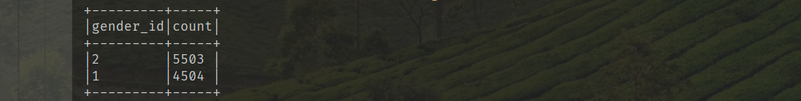

Получим ответ на вопрос, обращаясь к данным справочника `DictGender`, запустив программу со следующими аргументами:

`--data=dict_gender -s`

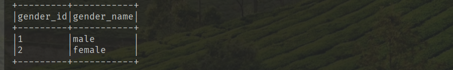

Также можно построить график, запустив программу со следующими аргументами:  

`--data=clients -v --viz-group-col=gender_id`

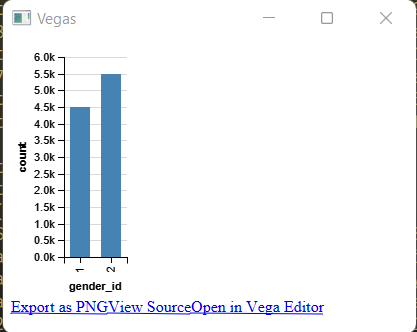

### 10.2 Пример анализа транзакций `Transactions`

Чтобы ответить на вопрос _Сколько транзакций было совершено днем с `13:00` до `18:00` 31 декабря 2020 года?_ нужно запустить программу со следующими аргументами:

`--data=transactions -s --viz-group-col=trans_time --start-date=2020-12-31 --end-date=2020-12-31`

В результате вычислений в консоль выведутся следующие данные:

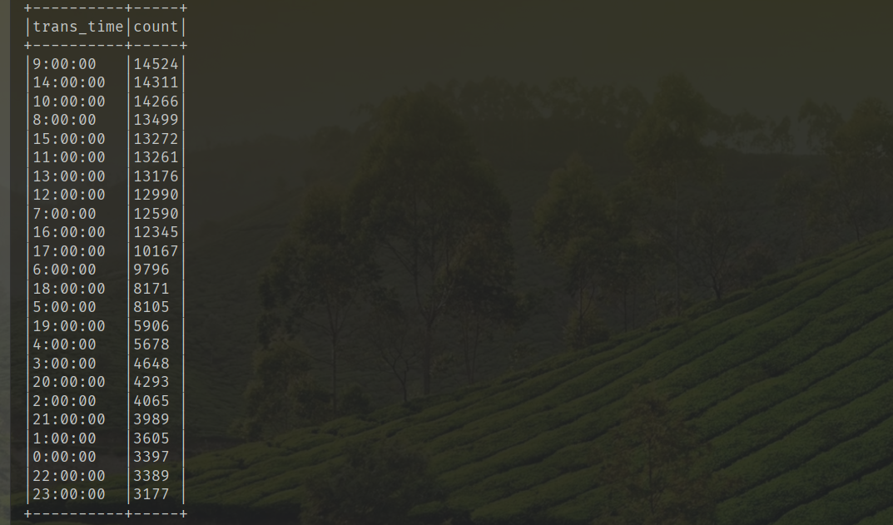

Получим ответ на вопрос, просуммировав нужные строки со временем:
* `13:00:00`
* `14:00:00`
* `15:00:00`
* `16:00:00`
* `17:00:00`
* `18:00:00`

### 10.3 Пример анализа торговых точек `SalesPoints`

Чтобы ответить на вопрос _Какова сумма транзакций в гео-квадрате с координатами `(55.60, 37.65)` за январь 2021 года?_ нужно запустить программу со следующими аргументами:

`--data=sales_points -s --num=2000 --viz-group-col=latitude_square,longitude_square --viz-sum-col=trans_sum --start-date=2021-01-01 --end-date=2021-01-31`

В результате вычислений в консоль выведутся данные по 2 тыс. гео-квадратов, среди которых и будет искомый `(55.60, 37.65)`:

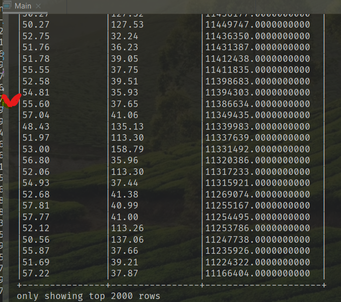
